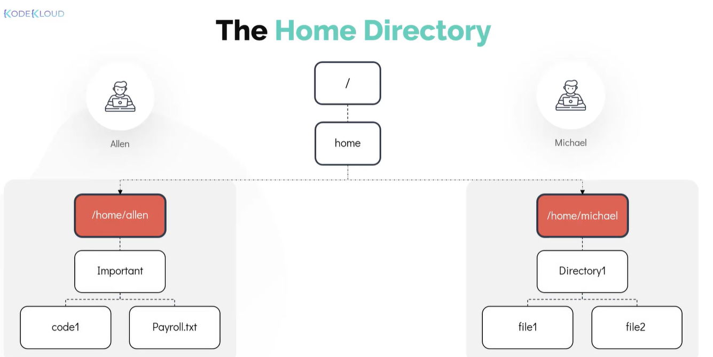

# 1 - Working With Shell

- Linux command line →  Shell
- The Linux Shell is:
    - a **program**
    - That allows **text based interaction**
    - between **user and the os**
- This interaction is carried out by typing commands into the interface (receiving response the same way).
- we can navigate between many folders (i.e different locations) using just the command line.
- first file when logged in → **/home**
- user directory (like a dedicated locker) → **/home/naveen**
- **/home** → **~** symbol (tilde)


### Command And Arguments

- User uses commands to interacts with the system
| sl no | command | description |
| --- | --- | --- |
|  1.| echo “message” | to print a message |
|  2.| uptime | shows uptime of the server |
|  3.| command <option><arguments> | echo=command -n=option hello=argument|

### Command Types

0. To find the type of command
```
type command
```

There are two types of commands
1. Internal Commands
    - these are built in commands
    - part of the shell
    - total of 30 such commands

```
echo, pwd, set, cd, mkdir etc
```
2. External Commands
    - binary programs that are pre-installed

```
mv, uptime, cp, date etc
```