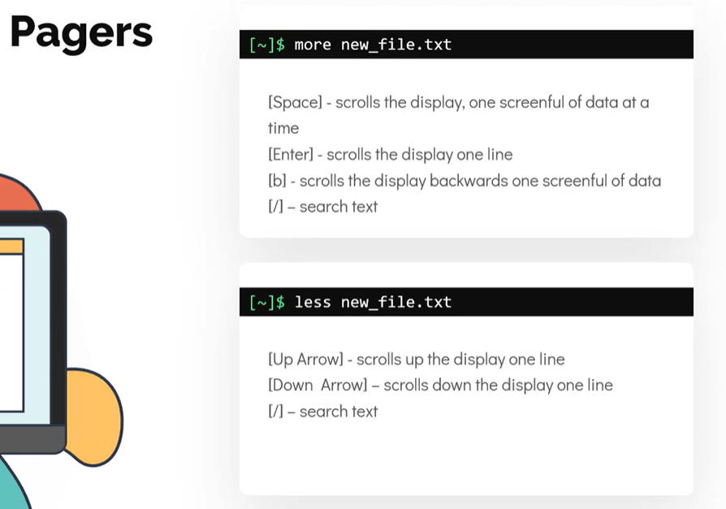
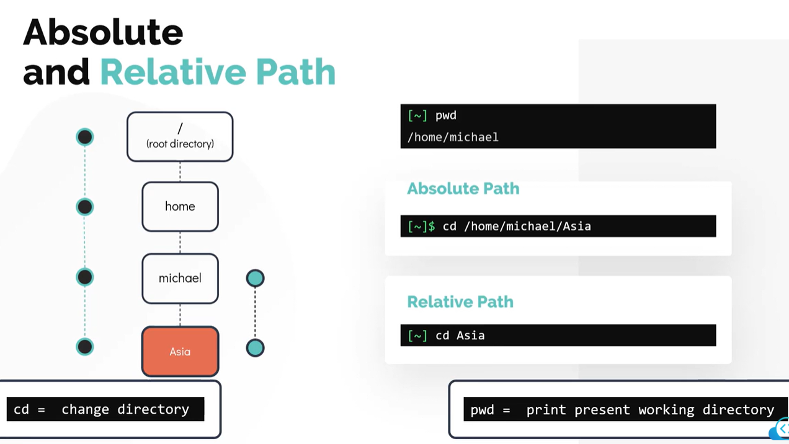
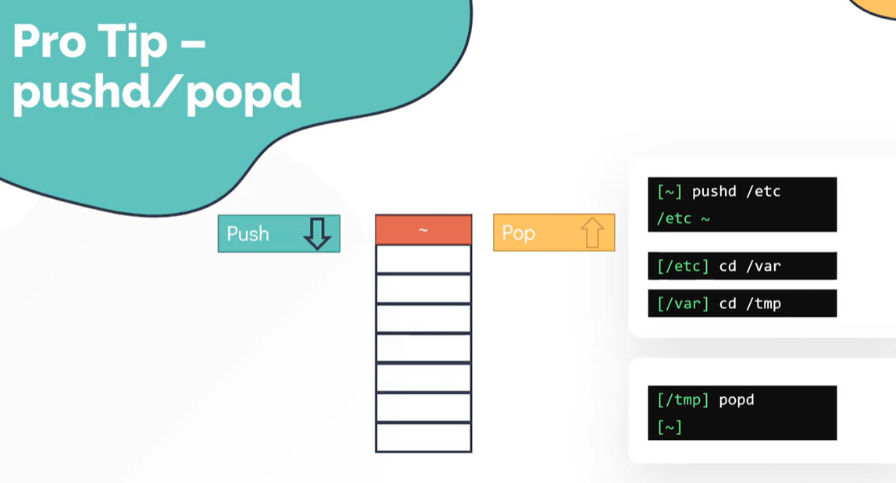

# Basic Linux Commands

1. Creating the below folder structure:


2. To check the present working directory

```
pwd
```

3. List contents
```
ls
```

4. Make directory:
```
mkdir Asia
```

5. Make multiple directories
```
mkdir Africa America Europe
```

6. Ls command to verify if folders are created:
```
ls
```

7. creating multiple sub folders (with missing parent folders)
```
mkdir -p Europe/UK Africa/Egypt/Cairo America/USA
```

8. Moving one folder or file to another (morroco -> from Europe to Africa)
```
mv  /workspace/linux-projects/1-shell-basics/Europe/Morocco /workspace/linux-projects/1-shell-basics/Africa/
```
Using absolute path above

9. copy file from one folder to another
```
cp Asia/India/munbai/city.txt Africa/Morocco
cp -rv source_folder destination_folder
cp -r source_folder destination_folder
```

10. Read files:
```
cat city.txt
```

11. edit and save:
```
cat > city.txt
cairo
ctrl+d (to save)
cat city.txt to read again
```

12. create files using touch command
```
touch abc.txt
```

13. using more or less command:


14. long list:
```
ls -l
```

15. list everything including hidden files:
```
ls -a
ls -la
```

16. Absolute and relative paths:


17. pushd/popd:
