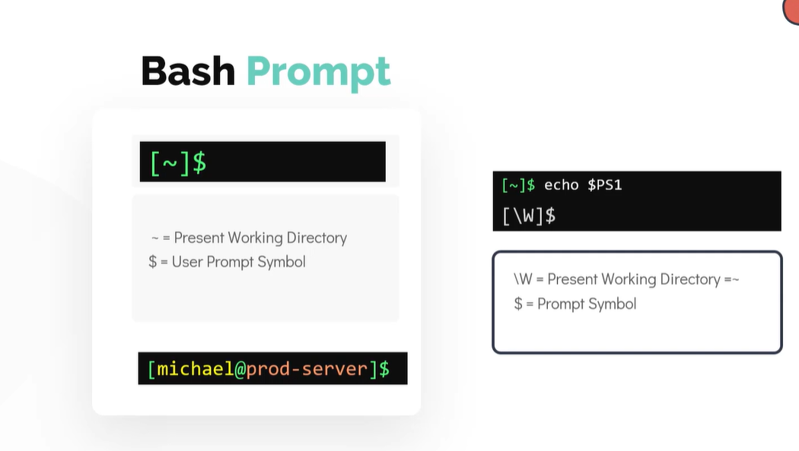

# Bash Shell

### Types of Shells:
- Bourne shell(sh)
- C shell (csh or tcsh)
- Korn shell (ksh)
- Z shell (zsh)
- Bourne again shell (bash)

### All shells have one purpose: Facilitate operation between user and OS.

1. Check the shell being used:
```
echo $SHELL
```

2. Bash provides auto completion features:
```
ls Africa (press tab)
```

3. setting alias
```
alias dt=date
```

4. history
```
history
```

### Bash Environment Variables

```
echo $SHELL
```

- Environment variables like the name suggests is used to store information (specific to the environment)
- stores information about user's login session (used by shell while executing commands)
- to see the list of environment variable -> 'env'
    ```
    env
    ```
- to set an environment variable use EXPORT command
    ```
    export OFFICE=caleston
    ```
- always use EXPORT command to make variables carry information forward beyond the shell to other process
- to make persistent changes to environment variables, add them to below file
    ```
    ~/.profile or ~/.pam_environment
    ```

### Path Variable
- path variable is used to search where the external commands are stored
```
echo $PATH
```




### Customize Bash Prompt

